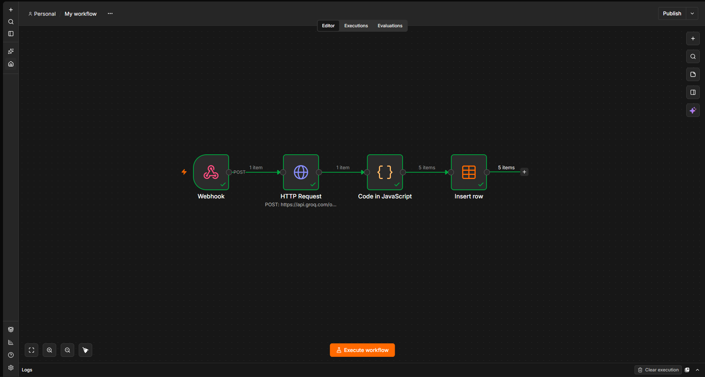
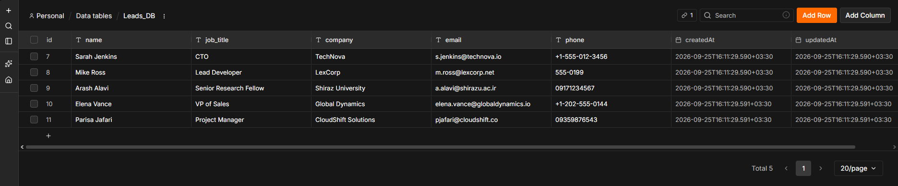

# ai-lead-parser-n8n
     Automated Lead Extraction & amp; Storage Workflow using n8n, Groq, and Database integration.

# 🤖 AI Lead Parser & Automation Pipeline (n8n + Groq)

An end-to-end automated pipeline designed to extract structured lead information from unstructured text and store it seamlessly into a database.

---

## 📌 Architecture & Workflow
```text
[ Incoming Webhook ] ──▶ [ Groq API ] ──▶ [ JavaScript Parsing ] ──▶ [ Database / Leads_DB ]
Webhook Trigger: Receives raw unstructured text via HTTP POST requests.
AI Extraction (Groq API): Utilizes Groq LLM inference with structured JSON prompting to extract key fields.
Data Normalization (JavaScript Node): Strips markdown fences, parses JSON safely, handles both single objects and arrays, and fills missing fields with fallbacks.
Database Storage: Automatically maps normalized lead records into dedicated table columns (name, job_title, company, email, phone).
🛠️ Tech Stack
Workflow Orchestration: n8n
LLM Engine: Groq API (gpt-oss-120b)
Data Processing: JavaScript (Node.js runtime inside n8n) & Python


Database: Relational Database / PostgreSQL / Airtable
📋 Schema Output
The pipeline outputs normalized data in the following structure:

json
[
  {
"name": "Sarah Jenkins",
"job_title": "CTO",
"company": "TechNova",
"email": "sarah.jenkins@technova.io",
"phone": "+1-555-0199"
  }
]


🚀 How to Run & Import
Clone or download this repository.
In your n8n instance:
Go to Workflows ➔ Import from File.
Select workflow.json.
Configure your Groq API Key in the Header Auth credentials.
Activate the workflow and send a POST request with unstructured text to your Webhook URL.
